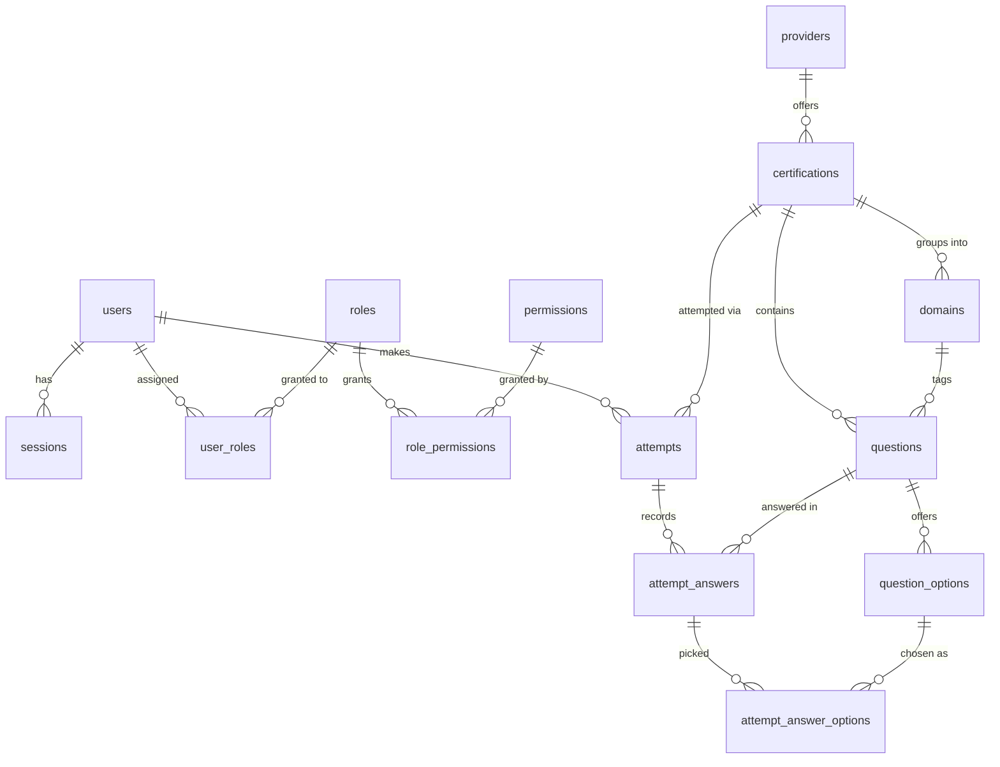

# Drill — database structure

Target engine: **PostgreSQL**. This document is the design pass before we write
migrations — nothing here is SQL yet, just the shape and the reasoning.

## Scope

Three things move out of process memory / flat files and into the database:

1. **Auth** — `users` and `sessions`, to back the login/signup popup already
   in the header.
2. **Roles & permissions** — an RBAC layer (`roles`, `permissions`,
   `role_permissions`, `user_roles`) so the upcoming admin panel can gate
   who gets in and what they can do there, without hardcoding "is admin"
   checks against a single flag.
3. **Content + history** — `data/questions.json` (certifications, domains,
   questions, options) and the quiz results that today are computed once and
   thrown away (`src/model.rs::score`, the `answers` hidden form field) become
   real rows, so "Recent attempts" and "best score" on the home page stop
   being stubs (`src/main.rs:110`, `src/main.rs:119`), and the admin panel has
   something to edit and something to report on.

## Design decisions

- **Every table uses a `bigserial` id — no text primary keys.** Earlier
  drafts kept `certifications.id` and `providers.id` as the natural text
  code (`saa`, `AWS`, …) since that's what the JSON and the URL
  (`/quiz/:cert_id`) already use. Switched to surrogate `bigserial` ids
  instead. Two reasons: FKs and indexes are cheaper as bigints than text,
  and it decouples the row's identity from a human-editable string
  (renaming a certification no longer means cascading a text key through
  five other tables).
- **`certifications.slug` carries the old text id, and it's what
  `/quiz/:cert_id` routes on** — not the `bigserial` PK. `saa` stays in the
  URL; the handler resolves it with `WHERE slug = $1` (one indexed lookup)
  instead of today's `Vec` scan in `Bank::cert`. `providers.name` plays the
  same role for that table (`AWS`, `GCP`, `K8s`) — short and stable enough
  that it didn't need a separate slug column of its own.
- **Options are rows, not an array.** Today a question stores
  `answer: Vec<usize>` (indices into `options`). Normalizing options into
  `question_options` with an `is_correct` flag per row is more relational —
  correctness lives with the option it describes — and it's what lets
  `attempt_answer_options` reference a specific option by id instead of a
  bare integer that only means something alongside the question's JSON blob.
- **`domains` is its own table**, scoped to a certification. Right now a
  domain is just a string repeated on every question that belongs to it
  (`Question.domain: String`); normalizing it means a typo can't silently
  create a phantom domain, and it gives scoring (`DomainScore` in
  `model.rs`) a stable id to group on instead of a string.
- **Attempts require a logged-in user** (`attempts.user_id` is `NOT NULL`).
  Anonymous play can keep working exactly as it does today — stateless,
  nothing written — until the user logs in; there's no guest-attempt
  table. This is the one decision most worth revisiting once the login flow
  is real: if "try a set before signing up" matters, guest attempts need
  either a nullable `user_id` or a claim-on-signup path.
- **Sessions are DB-backed, not JWT.** One row per logged-in session, `id`
  is the opaque cookie value. Simplest thing that works; revoking a session
  is a `DELETE`.
- **Roles and permissions are separate tables, not a `users.role` enum
  column.** An admin panel is coming, and the moment there's more than one
  kind of staff access — say a full admin vs. someone who can only edit
  questions — an enum column means new code for every new distinction. Join
  tables (`user_roles`, `role_permissions`) mean the initial `admin`/`user`
  split can grow into `content_editor`, `support`, etc. by inserting rows,
  not shipping a migration and a redeploy. A user can hold more than one
  role (a person can be both `admin` and a normal quiz-taker).
- **Permissions attach to roles, not directly to users.** No per-user
  permission overrides. Keeps "what can this person do" answerable by
  looking at one small `user_roles` row instead of reconciling role
  defaults against a pile of exceptions. Flagged under Open Questions if
  that turns out to be too rigid.
- **Passwords:** `password_hash` only, hashed with Argon2id at the
  application layer. Never a plaintext column, never reversible.

## Entity overview



## Tables

### Auth & access control

#### `users`

Backs the login/signup popup (`templates/home.html`'s `#authOverlay`).

| column          | type          | notes                                  |
|-----------------|---------------|-----------------------------------------|
| `id`            | uuid, PK      | `gen_random_uuid()`                    |
| `name`          | text, not null | shown in the header once logged in    |
| `email`         | citext, unique, not null | login identifier            |
| `password_hash` | text, not null | Argon2id, computed app-side           |
| `created_at`    | timestamptz, not null, default `now()` |                        |
| `updated_at`    | timestamptz, not null, default `now()` |                        |

`citext` (case-insensitive text) needs the `citext` extension so
`Ims@x.com` and `ims@x.com` collide on the unique constraint — the usual
footgun for email logins otherwise.

#### `sessions`

| column       | type        | notes                                      |
|--------------|-------------|---------------------------------------------|
| `id`         | uuid, PK    | the session-cookie value                    |
| `user_id`    | uuid, not null, FK → `users.id` on delete cascade |               |
| `created_at` | timestamptz, not null, default `now()` |                          |
| `expires_at` | timestamptz, not null | app sets this, e.g. `now() + 30 days` |

#### `roles`

| column        | type      | notes                                        |
|---------------|-----------|-------------------------------------------------|
| `id`          | smallserial, PK |                                            |
| `name`        | text, unique, not null | `admin`, `user` to start; the admin panel adds more without a migration |
| `description` | text      |                                              |
| `created_at`  | timestamptz, not null, default `now()` |                        |

Seed data: `user` (granted to everyone on signup) and `admin` (granted
manually / via a seed script — nobody signs up as admin through the popup).

#### `permissions`

| column        | type      | notes                                              |
|---------------|-----------|-------------------------------------------------------|
| `id`          | bigserial, PK |                                                    |
| `key`         | text, unique, not null | dotted `resource.action`, e.g. `certifications.write` |
| `description` | text      |                                                      |

Seed data, one row per admin-panel capability — grows as the panel does:

```
admin.access            -- can open the admin panel at all
certifications.write    -- create/edit certifications, domains, questions, options
certifications.delete
users.manage            -- view users, change roles
attempts.view_all       -- see every user's attempts, not just their own
roles.manage            -- edit roles/permissions themselves
```

#### `role_permissions`

Junction: which permissions a role carries.

| column          | type      | notes                                       |
|-----------------|-----------|------------------------------------------------|
| `role_id`       | smallint, not null, FK → `roles.id` on delete cascade |             |
| `permission_id` | bigint, not null, FK → `permissions.id` on delete cascade |         |

Primary key is the pair `(role_id, permission_id)`.

#### `user_roles`

Junction: which roles a user holds. A permission check is
`user → user_roles → role_permissions → permissions`.

| column       | type       | notes                                          |
|--------------|------------|---------------------------------------------------|
| `user_id`    | uuid, not null, FK → `users.id` on delete cascade |                |
| `role_id`    | smallint, not null, FK → `roles.id` on delete cascade |            |
| `granted_at` | timestamptz, not null, default `now()` |                          |

Primary key is the pair `(user_id, role_id)`. "Is this user an admin?" is

```sql
select exists (
  select 1 from user_roles ur
  join roles r on r.id = ur.role_id
  where ur.user_id = $1 and r.name = 'admin'
);
```

and a real permission check (what the admin panel should actually gate on,
rather than the role name) is

```sql
select exists (
  select 1 from user_roles ur
  join role_permissions rp on rp.role_id = ur.role_id
  join permissions p on p.id = rp.permission_id
  where ur.user_id = $1 and p.key = 'certifications.write'
);
```

### Content

#### `providers`

The three fixed platforms. A lookup table instead of repeating
`providerLabel` on every certification row.

| column  | type      | notes                              |
|---------|-----------|--------------------------------------|
| `id`    | bigserial, PK |                                    |
| `name`  | text, unique, not null | `AWS`, `GCP`, `K8s` — matches `Cert.provider` today; the code, not the display label |
| `label` | text, not null | `Amazon Web Services`, `Google Cloud`, `Kubernetes / CNCF` |

#### `certifications`

One row per exam track (today: `saa`, `dva`, `ace`, `pca`, `cka`).

| column        | type          | notes                                   |
|---------------|---------------|-------------------------------------------|
| `id`          | bigserial, PK |                                          |
| `slug`        | text, unique, not null | `saa`, `dva`, … — was the JSON/text id; now just a column. This is what `/quiz/:cert_id` matches on |
| `provider_id` | bigint, not null, FK → `providers.id` |                    |
| `code`        | text, not null | e.g. `SAA-C03`                         |
| `name`        | text, unique, not null | e.g. `Solutions Architect – Associate` |
| `difficulty`  | text, not null | `Associate` \| `Professional` today    |
| `blurb`       | text, not null |                                         |
| `pass_mark`   | integer, not null | percent; was one global value (`Bank.pass_mark`) — moved per-cert since nothing stops different exams having different bars |
| `created_at`  | timestamptz, not null, default `now()` |                       |
| `updated_at`  | timestamptz, not null, default `now()` |                       |

#### `domains`

| column               | type      | notes                              |
|----------------------|-----------|---------------------------------------|
| `id`                 | bigserial, PK |                                    |
| `certification_id`   | bigint, not null, FK → `certifications.id` on delete cascade |   |
| `name`               | text, not null |                                    |
| `sort_order`         | integer, not null | preserves the JSON array order for the domain breakdown on the results page |

Unique on `(certification_id, name)`.

#### `questions`

| column               | type      | notes                                        |
|----------------------|-----------|-------------------------------------------------|
| `id`                 | bigserial, PK |                                              |
| `certification_id`   | bigint, not null, FK → `certifications.id` on delete cascade |       |
| `domain_id`          | bigint, not null, FK → `domains.id`         |
| `body`               | text, not null | the `q` field                              |
| `explain`            | text, not null | shown after reveal                         |
| `sort_order`         | integer, not null | `Cert::set()` today just takes the first `SET_LENGTH` (20) questions in file order — this column keeps that meaning explicit instead of implicit array position |
| `created_at`         | timestamptz, not null, default `now()` |                          |
| `updated_at`         | timestamptz, not null, default `now()` |                          |

#### `question_options`

| column          | type      | notes                                          |
|-----------------|-----------|-----------------------------------------------------|
| `id`            | bigserial, PK |                                                |
| `question_id`   | bigint, not null, FK → `questions.id` on delete cascade |             |
| `option_index`  | smallint, not null | 0-based, drives the A–F letter (`model.rs::LETTERS`) — max seen today is 5 options |
| `body`          | text, not null |                                                |
| `is_correct`    | boolean, not null, default `false` |                              |

Unique on `(question_id, option_index)`. A question's correct-answer set
(today `Question.answer: Vec<usize>`) is just
`SELECT option_index FROM question_options WHERE question_id = ? AND is_correct`.

### Activity

#### `attempts`

One row per finished quiz run — the thing `src/main.rs::results()` computes
and currently discards.

| column               | type       | notes                                            |
|----------------------|------------|------------------------------------------------------|
| `id`                 | bigserial, PK |                                                    |
| `user_id`            | uuid, not null, FK → `users.id` on delete cascade |               |
| `certification_id`   | bigint, not null, FK → `certifications.id`         |
| `started_at`         | timestamptz, not null |                                          |
| `finished_at`        | timestamptz | null while in progress                            |
| `elapsed_seconds`    | integer, not null, default `0` | mirrors the `elapsed` hidden field / `#clock` |
| `total_questions`    | integer, not null |                                                |
| `correct_count`      | integer, not null, default `0` |                                  |
| `wrong_count`        | integer, not null, default `0` |                                  |
| `skipped_count`      | integer, not null, default `0` |                                  |
| `pct`                | integer | null until finished; `Score.pct` today               |

`best_label` on the home page becomes
`SELECT max(pct) FROM attempts WHERE user_id = ? AND certification_id = ? AND finished_at IS NOT NULL`,
and "Recent attempts" is the same table ordered by `finished_at desc`. The
admin panel's `attempts.view_all` permission is what lets a report drop the
`user_id = ?` filter and show every user's runs.

#### `attempt_answers`

One row per question the user reached within an attempt — the durable form
of the `Answers` map (`BTreeMap<usize, Vec<usize>>` in `model.rs`) that
today only exists inside a hidden `<input>` for the life of one request.

| column         | type      | notes                                       |
|----------------|-----------|-------------------------------------------------|
| `id`           | bigserial, PK |                                              |
| `attempt_id`   | bigint, not null, FK → `attempts.id` on delete cascade |          |
| `question_id`  | bigint, not null, FK → `questions.id`       |
| `is_correct`   | boolean, not null |                                          |
| `answered_at`  | timestamptz, not null, default `now()`      |

Unique on `(attempt_id, question_id)` — one answer per question per attempt,
same invariant the `BTreeMap` gave for free today.

#### `attempt_answer_options`

Junction table: which option(s) the user actually picked (questions can be
multi-select — `model.rs::is_correct` compares two sorted `Vec<usize>`).

| column              | type      | notes                            |
|---------------------|-----------|--------------------------------------|
| `attempt_answer_id` | bigint, not null, FK → `attempt_answers.id` on delete cascade |  |
| `question_option_id`| bigint, not null, FK → `question_options.id` |            |

Primary key is the pair `(attempt_answer_id, question_option_id)` — no
surrogate id needed, it's a pure join table.

## Indexes worth adding beyond the PKs/uniques above

- `sessions(user_id)` — session lookups on every authenticated request.
- `user_roles(role_id)` — "who holds this role" (the pair PK already covers
  "what roles does this user hold" via its leftmost column).
- `role_permissions(permission_id)` — same reasoning, reverse direction.
- `attempts(user_id, certification_id, finished_at)` — the home-page
  "best score" and "recent attempts" queries filter and sort on exactly
  this.
- `questions(certification_id, sort_order)` — reconstructing `Cert::set()`.

## How `data/questions.json` maps over

For the later migration/import script:

| JSON                                   | table                                    |
|-----------------------------------------|-------------------------------------------|
| `certifications[].provider` / `.providerLabel` | `providers` row, deduped on `name = provider`; `certifications.provider_id` resolved by looking up that row's `id` |
| `certifications[]` (minus `questions`, `domains`) | one `certifications` row — its JSON `id` (`saa`, …) becomes the `slug` column, not the primary key |
| `certifications[].domains[]`            | `domains` rows, `sort_order` = array index |
| `certifications[].questions[]`          | `questions` rows, `sort_order` = array index, `domain_id` resolved by name |
| `questions[].options[]`                 | `question_options` rows, `option_index` = array index |
| `questions[].answer[]`                  | sets `is_correct = true` on the matching `question_options` rows |
| `passMark` (bank-level)                 | copied onto every `certifications.pass_mark` (then can diverge per cert) |

Roles/permissions have no JSON source — they're seeded directly by the
migration that creates the tables (the `roles`, `permissions` and
`role_permissions` rows under Seed data above), not imported from a file.

## Open questions / deliberately deferred

- **Guest attempts.** Not modeled — see the design-decisions note above.
- **Per-user permission overrides.** Permissions only flow through roles
  right now; if a one-off "this specific user can also do X" need shows up,
  it's a `user_permissions` override table with the same shape as
  `role_permissions`, checked in addition to the role-derived set.
- **Resuming an in-progress attempt across page loads/devices.** The schema
  allows it (`finished_at` nullable, `attempt_answers` can be upserted as
  you go) but the current request flow doesn't need it, since state travels
  in the form. Wiring that up is a separate change to `quiz_step`.
- **Password reset / email verification.** No tables for tokens yet — add a
  `password_reset_tokens` (or similar) table when that flow gets built.
- **Full-text or fuzzy search over questions.** Not needed yet; flagged for
  when the admin panel's question list needs it.

## Next step

Once this shape is agreed, translate each table above into a numbered
migration (likely via `sqlx migrate`), respecting FK order — roughly:

1. `users`, `providers` (no dependencies)
2. `roles`, `permissions` (no dependencies)
3. `role_permissions` (needs `roles`, `permissions`) + seed the roles/permissions from above
4. `sessions`, `user_roles` (need `users`; `user_roles` also needs `roles`)
5. `certifications` (needs `providers`)
6. `domains` (needs `certifications`)
7. `questions` (needs `certifications`, `domains`)
8. `question_options` (needs `questions`)
9. `attempts` (needs `users`, `certifications`)
10. `attempt_answers` (needs `attempts`, `questions`)
11. `attempt_answer_options` (needs `attempt_answers`, `question_options`)
